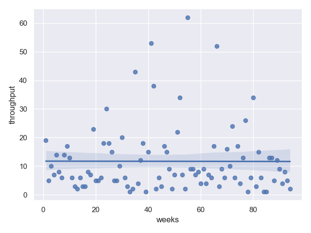
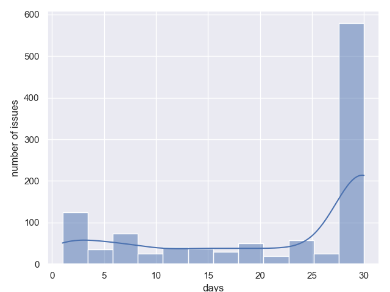
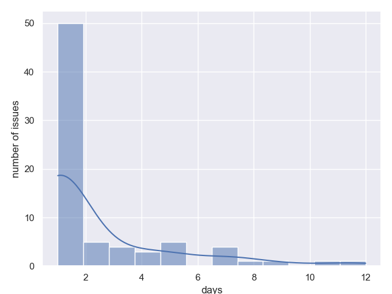

[](https://codeclimate.com/github/smirnoffmg/metrics/maintainability)

# Development team metrics

Measure your dev team metrics using python and your task tracker.

## Supported task trackers

    - Jira

## Supported metrics

    - Throughput
    - Lead time
    - Cycle time
    - Queue time

## Articles

    - [Метрики команды разработки](https://habr.com/ru/articles/788930/)
    - [Software engineering metrics](https://medium.com/@maximsmirnov/software-engineering-metrics-613be9b99ccd)

## How to run?

```shell
poetry install
poetry run python -m metrics --help
```

```shell
poetry run python -m metrics --jira-server YOUR_SERVER_URL --jira_token YOUR_PERSONAL_TOKEN --jira-jql "project = Dev (for example)"
```

## Example output

### Throughput



### Lead time


### Cycle time



### Queue time for every status

#### Status "New"


#### Status "Test"


