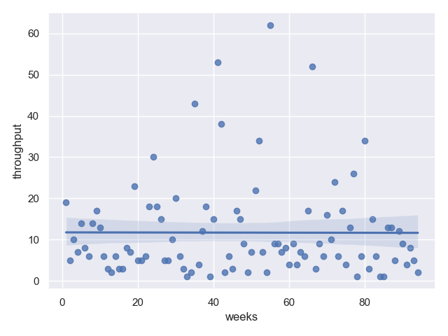

# Development team metrics

Measure your dev team metrics using python and your task tracker.

## Supported task trackers

    - Jira

## How to run?

```shell
poetry install
poetry run python -m metrics --help
```

```shell
poetry run python -m metrics --jira-server YOUR_SERVER_URL --jira_token YOUR_PERSONAL_TOKEN --jira-jql "project = Dev (for example)"
```

## Example output

### Througput



### Lead time


### Cycle time


### Queue time for every statys

#### Status "New"


#### Status "Test"


