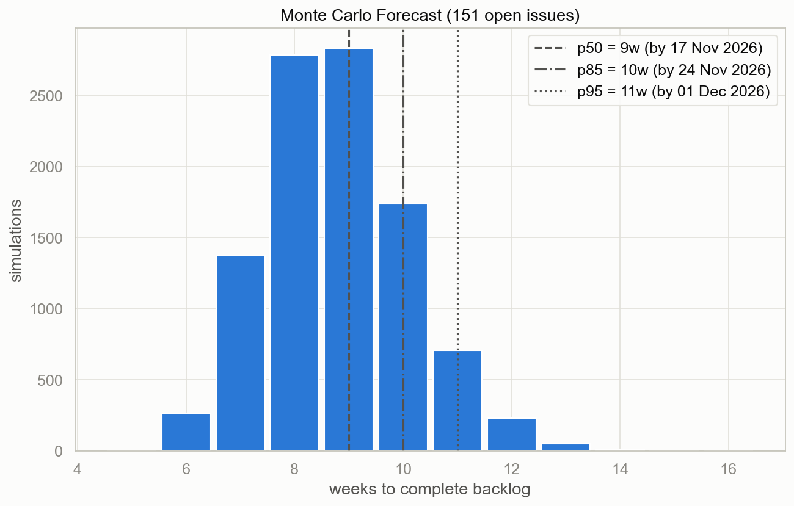
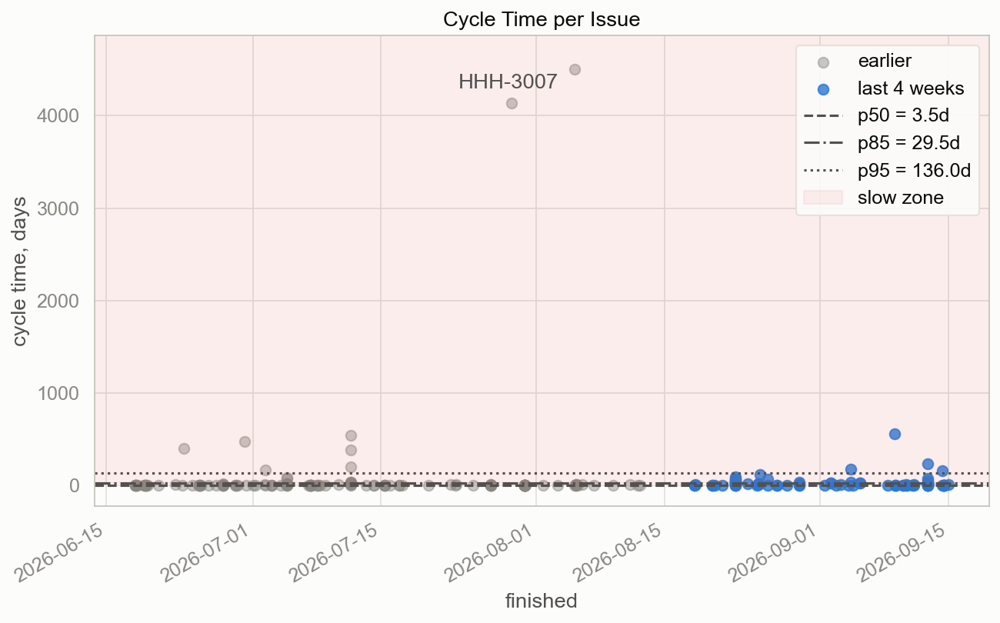
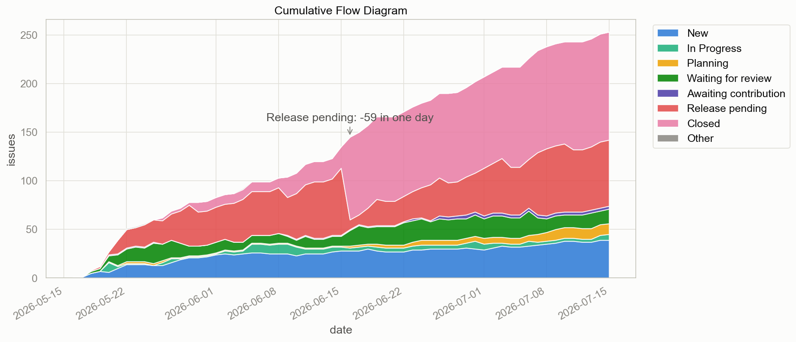
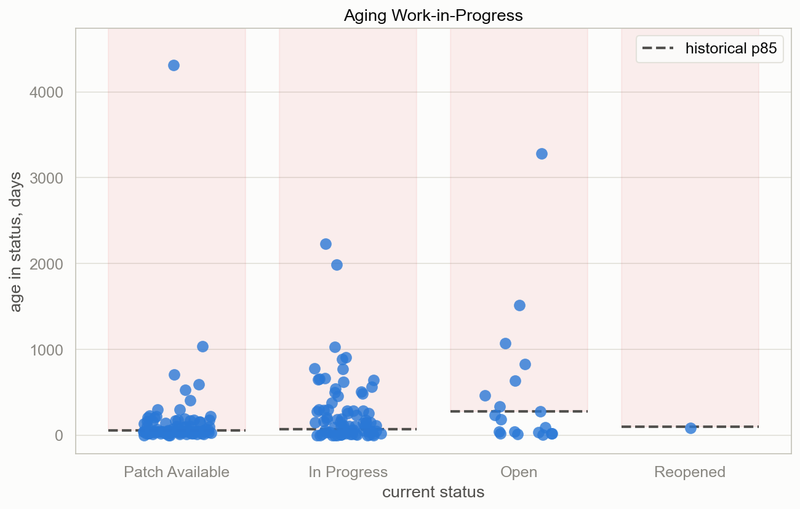
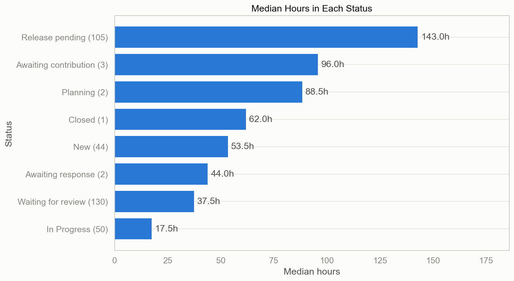
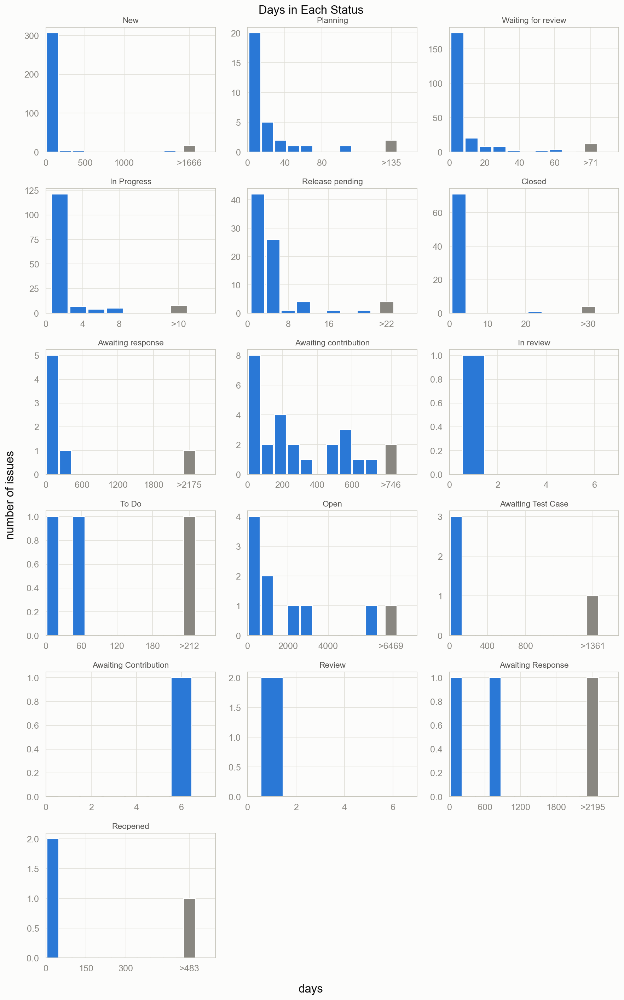
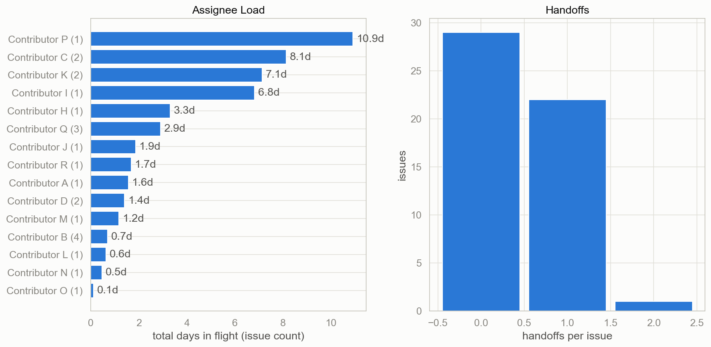
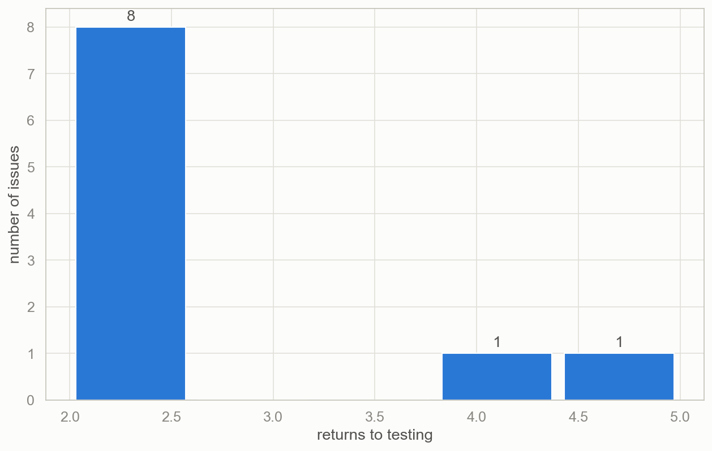

# Metrics - Jira analytics for engineering teams

[](https://github.com/smirnoffmg/metrics/actions)
[](LICENSE)

See how work really flows through your team - straight from Jira, in one command.

**Metrics** pulls your issues and turns them into clear charts plus a single shareable report:

- **How fast are we?** Lead time, cycle time, and a percentile view - "85% of our tickets finish within N days"
- **When will it be done?** A Monte Carlo forecast for your open backlog
- **Where does work get stuck?** Time per status, aging work-in-progress, and a cumulative flow diagram
- **Who carries the load?** Time in flight per person and how often tickets change hands
- **How much do we ship?** Weekly throughput and how often tickets bounce back to testing

Everything lands in `output/` as PNG charts and one self-contained `report.html` you can send to anyone - no servers, no setup, nothing leaves your machine. The report is interactive: headline numbers with trend arrows, hover any dot for the ticket details, click it to open the issue in Jira, and a ready-made list of the longest-waiting tickets.

## Real examples

Every chart below comes from real public projects - the [Hibernate ORM](https://hibernate.atlassian.net) and [Apache Kafka](https://issues.apache.org/jira) issue trackers.

### When will it be done?

**Monte Carlo forecast.** Half the simulations finish 142 open Hibernate issues by late September; 85% by 21 October - real dates, not story points.



**Weekly throughput.** How many issues get finished each week, with the overall trend.


### How fast do tickets finish?

**Cycle time, ticket by ticket.** Every dot is a finished Hibernate issue - the last 4 weeks in blue, the slowest ticket named, and the "slow zone" beyond p85 tinted red.



**Lead time.** From the moment a ticket is created to the moment it's done.


**Cycle time distribution.** The same story as the scatterplot, as a simple histogram.


### Where does work get stuck?

**Cumulative flow.** Two months of Hibernate: each band is a status, widening bands are bottlenecks - and notable events annotate themselves, like 59 issues leaving "Release pending" in one day.



**Aging work-in-progress.** Open Kafka issues by how long they've sat in their current status - anything above the dashed line has been waiting longer than 85% of past work ever did.



**Median time per status.** Where a ticket's calendar time actually goes.



**Days in each status.** Every status of the workflow at a glance, one histogram each.



### How does the team work?

**Who carries the work.** Time in flight per assignee (names anonymized here) and how often tickets change hands.



**Rework.** How many times tickets came back to review - each return is work done twice.



## Try it in one minute - no account needed

Point it at any public Jira, like Hibernate's:

```sh
uv sync
uv run python -m metrics --anonymous \
  --jira-server https://hibernate.atlassian.net \
  --jira-jql 'project = HHH AND created >= -60d' \
  --testing-statuses "In review, Waiting for review"

open output/report.html
```

## Get started with your own Jira

```sh
uv run python -m metrics --jira-server https://your-jira --jira-token <token> --jira-jql 'project=MYPROJ'
```

Then open `output/report.html`.

- **Jira Cloud:** also pass `--jira-email you@company.com` together with an API token.
- **Jira Server / Data Center:** just a personal access token, no email needed.
- **Public instance?** `--anonymous` needs no credentials at all and figures out Cloud vs Server by itself.
- **Your workflow ends differently?** Tell it what "finished" means, e.g. `--done-statuses "Resolved, Shipped"` (default: done, completed, cancelled, closed, resolved).
- **QA has its own name?** Same for the rework metric, e.g. `--testing-statuses "In review, QA"` (default: testing).
- **Curious how much time is real work vs waiting?** Tell it where work happens, e.g. `--active-statuses "In Progress, In Development"` (default: in progress) - that powers the flow-efficiency number in the report.
- Prefer environment variables or a config file? `uv run python -m metrics --help` shows every option.

Tip: let your JQL include both finished and still-open issues - the forecast and aging charts need the open ones.

## License

GPL - see [LICENSE](LICENSE).
