# Metrics - a Jira delivery forecast that honestly says how far you can trust it

[](https://github.com/smirnoffmg/metrics/actions)
[](LICENSE)

Most forecasts give you a date. This one tells you how much of your open work gets done, replays that same promise from every past Monday, and says in plain words how often it came true - before you commit to it. Straight from Jira, in one command, into one self-contained `report.html` you can send to anyone. No servers, nothing leaves your machine.

## What it tells you

Every quote below is copied from the report on two years of the public [Hibernate ORM](https://hibernate.atlassian.net) and [Apache Kafka](https://issues.apache.org/jira) trackers.

**1. How much of our open work gets done, and when?**

> At least 22 of the 2093 open issues will be done in 8 weeks, by 28 Nov 2026 (85% chance).
>
> *- Hibernate*

The promise counts only issues open today. New work keeps arriving and takes its share of the team, so the forecast scales throughput by the share of past finishes that went to issues already open, measured over the same number of weeks.

**2. Can I trust that number?**

> Past 8-week promises like this one held 9 of 11 times, in line with the 85% promised.
>
> Commit to the number, but don't promise a date for all of it; forecast a specific release instead (--forecast-jql).
>
> *- Hibernate*

The same forecast is replayed from every past Monday, from only what Jira showed that day, and checked against what happened next. "9 of 11" counts promises whose outcomes don't overlap, so each one is real evidence. An honest 85% promise still misses now and then, so 9 of 11 is judged against chance, not against a fixed 85% cutoff: only a count so low that an honest 85% promise would score it or fewer under 5% of the time (one-sided binomial test) makes the report call the number optimistic and say to commit to fewer. Otherwise it says to commit to the number.

**3. Will the open list ever clear?**

> About 35.4 issues arrive and 23.5 get done a week; more arrive than get done.
>
> Not all 5283 open issues will be done within 2 years at this pace; no past date like it has come due to check it.
>
> *- Kafka*

When arrivals keep up with finishes, a list may never return to zero, so the report would rather say "not within 2 years" than invent a date. For a date worth promising, forecast a release or an epic with `--forecast-jql`.

## Try it in one minute - no account needed

Point it at any public Jira, like Hibernate's:

```sh
uv sync
uv run python -m metrics --anonymous \
  --jira-server https://hibernate.atlassian.net \
  --jira-jql 'project = HHH AND (resolved >= -365d OR resolution = Unresolved)' \
  --testing-statuses "In review, Waiting for review"

open output/report.html
```

Fetch a year of history: the replay needs it to measure how much of the work goes to issues already open, and to have enough past promises to judge. With less, the report says so - the share goes unmeasured, and too few past promises leave the forecast unchecked. The forecast itself needs seven weeks of finishes: the first is left out, since the query may start partway through it.

## Get started with your own Jira

```sh
uv run python -m metrics --jira-server https://your-jira --jira-token <token> \
  --jira-jql 'project = MYPROJ AND (resolved >= -365d OR resolution = Unresolved)'
```

Then open `output/report.html`.

- **Jira Cloud:** also pass `--jira-email you@company.com` together with an API token.
- **Jira Server / Data Center:** just a personal access token, no email needed.
- **Public instance?** `--anonymous` needs no credentials at all and figures out Cloud vs Server by itself.
- **When will this release or epic be done?** Name its issues with `--forecast-jql 'fixVersion = "9.0"'`. With seven weeks or more of its own finishes it is forecast from them, which already leave out the time the team spent on other work, and replayed like the main forecast. If you'd rather state how much of the team works on it, `--forecast-focus 0.5` forecasts at half the team's pace; the report marks that as an assumption it cannot check. With too few finishes of its own and no focus, the release is forecast at the whole team's pace, also marked not checked.
- **Your workflow ends differently?** Tell it what "finished" means, e.g. `--done-statuses "Resolved, Shipped"`. By default Jira's own status categories decide: statuses in the Done category finish an issue, statuses in To Do are backlog.
- **Dropped work isn't delivery.** Statuses like `--discarded-statuses "Rejected, Duplicate"` (default: cancelled, canceled, won't do) count neither as throughput nor as open work. The same goes for issues closed with a resolution like Won't Fix or Duplicate - set your own with `--discarded-resolutions "Won't Fix, Out of scope"`.
- **Cycle time starts at commitment, not at triage.** It runs from the moment an issue first leaves the backlog; by default, when it first leaves Jira's To Do category; name your pre-work statuses yourself with `--backlog-statuses "Open, Ready"`. Issues closed straight from the backlog have a lead time but no cycle time.
- **QA has its own name?** Same for the rework metric, e.g. `--testing-statuses "In review, QA"` (default: testing).
- **Curious how much time is real work vs waiting?** Tell it where work happens, e.g. `--active-statuses "In Progress, In Development"` (default: in progress) - that powers the flow-efficiency number: the share of cycle time spent in those statuses.
- **Iterating on settings?** Fetch once with `--save-raw issues.json`, then rebuild the report as often as you like with `--from-raw issues.json` - no network, seconds instead of minutes, and the same numbers every time, since time-based metrics are computed as of the fetch.
- Prefer environment variables or a config file? `uv run python -m metrics --help` shows every option.

Tip: let your JQL include both finished and still-open issues - the forecast and aging charts need the open ones. Select finished issues by when they were resolved: a window on `created` leaves out the old issues your team is finishing now and understates throughput, and one on `updated` pulls in issues closed years ago.

## Charts that explain the forecast

**The forecast as a fan.** How many of today's open issues stay open, week by week: the dashed line is the even bet, the solid line the 85% one, and the dot marks the horizon the replay could check. Beyond it the fan is extrapolated.

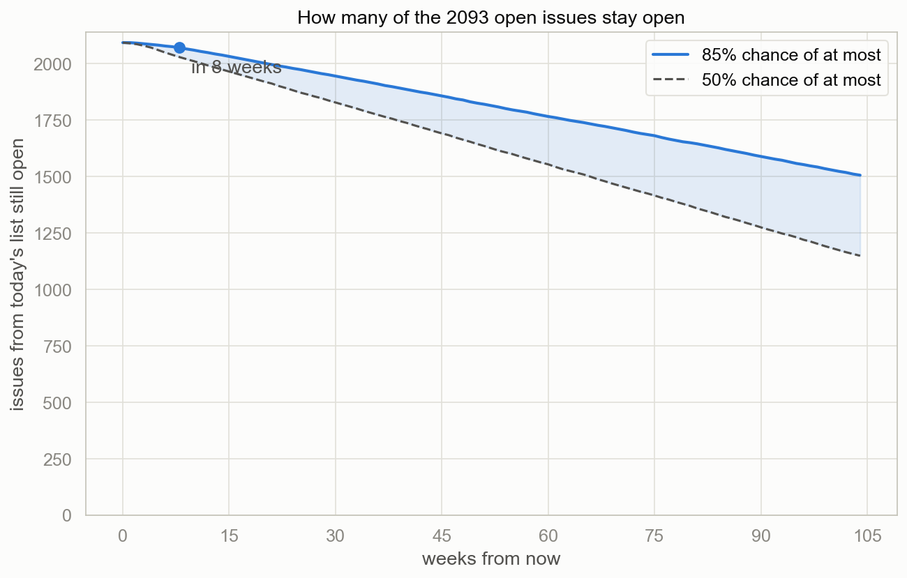

**Cumulative flow: arrivals vs departures.** Each band is a status. The top edge climbs with every issue that arrives, the done bands with every issue that leaves; while the open bands beneath them keep their height, the open list isn't shrinking, whatever the team's pace. Notable events annotate themselves, like a release closing a pile of issues in one day.

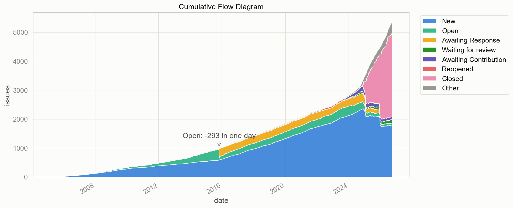

**Aging work-in-progress.** Started, unfinished Kafka issues by how long they've sat in their current status - anything above the dashed line has been waiting longer than 85% of past work ever did. The report also lists the longest-waiting tickets.

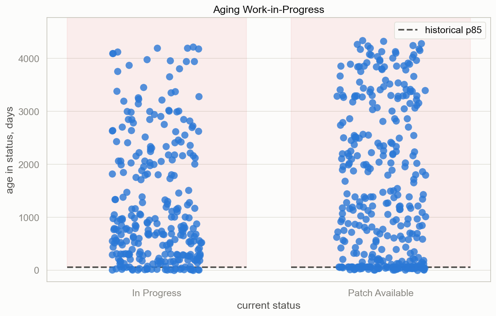

**Cycle time, ticket by ticket.** Every dot is a finished Hibernate issue - the most recent in blue, the slowest named, and the "slow zone" beyond p85 tinted red. Hover a dot in the report for the ticket, click it to open it in Jira.

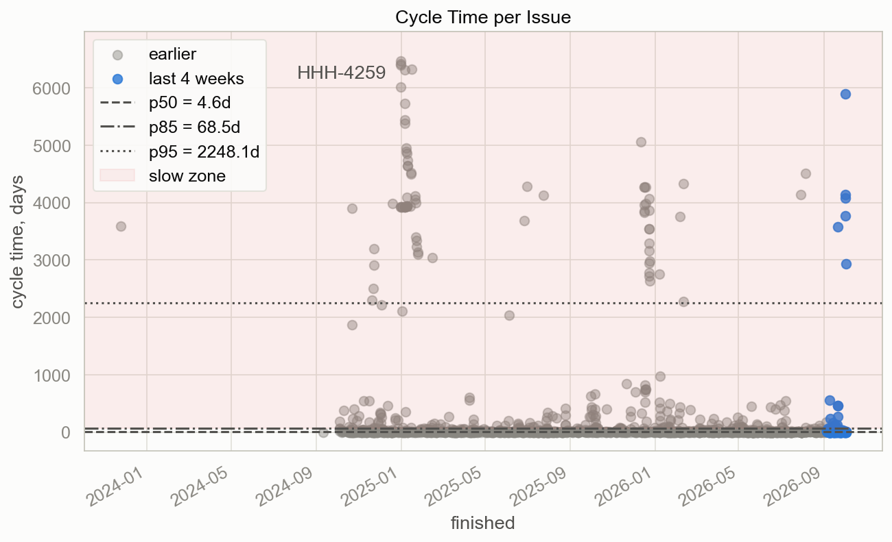

**Cycle time distribution.** The same story as a histogram with p50 and p85 marked.

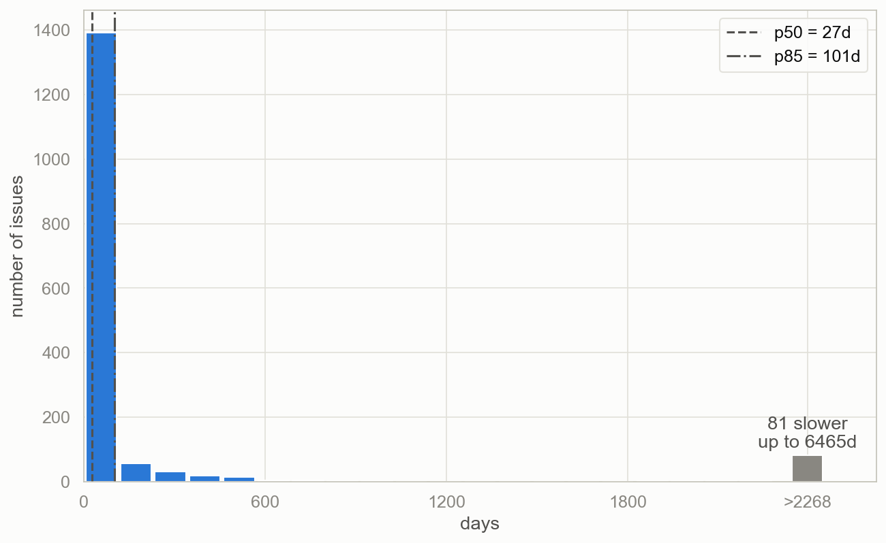

**Weekly throughput.** How many issues get finished each week, with the trend. The week still in progress is left out, and quiet weeks count as zero.

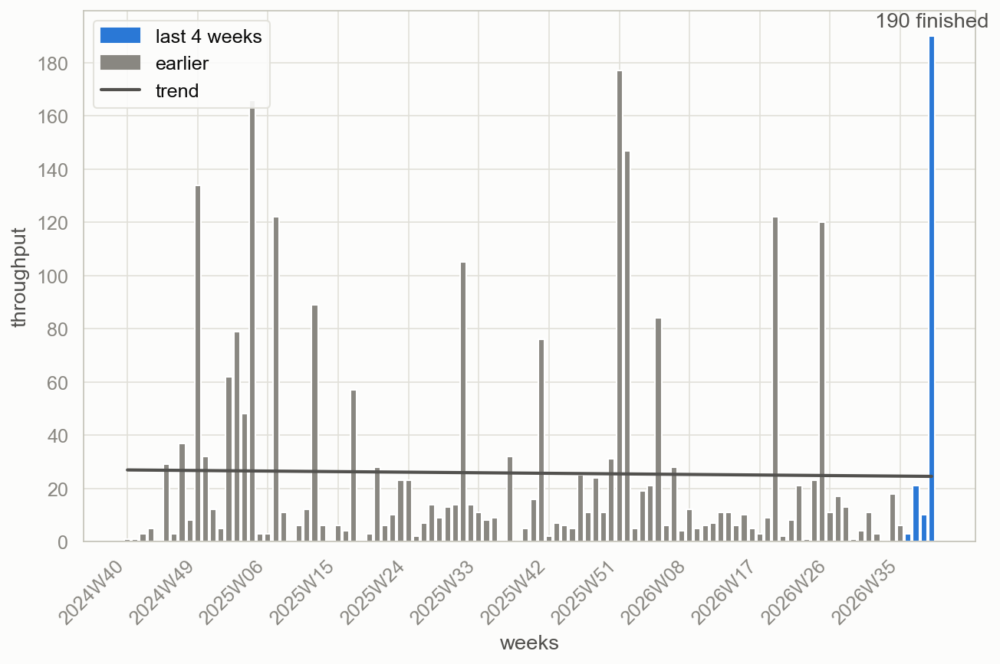

## Also in the report

**Handoffs.** How often an issue changes hands before it's done - a property of the process, not of a person.

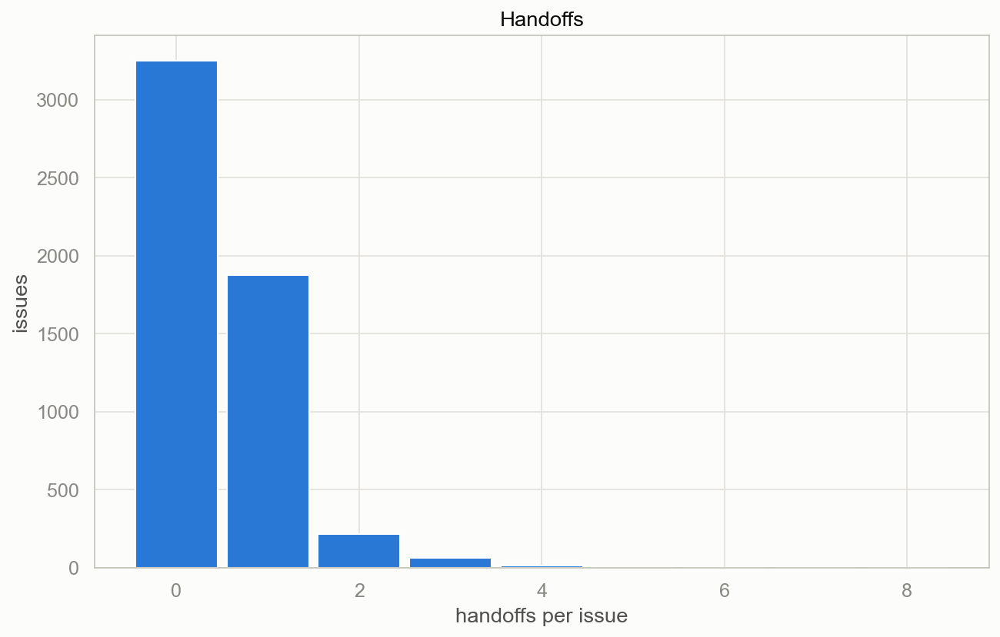

**Lead time.** From the moment a ticket is created to the moment it's done.

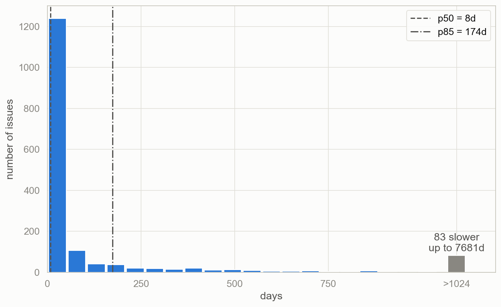

**Where a ticket's calendar time goes.** The median time per status, and every status's own histogram.

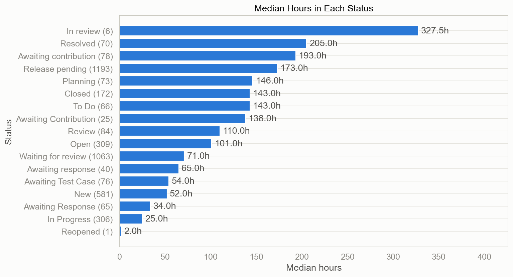

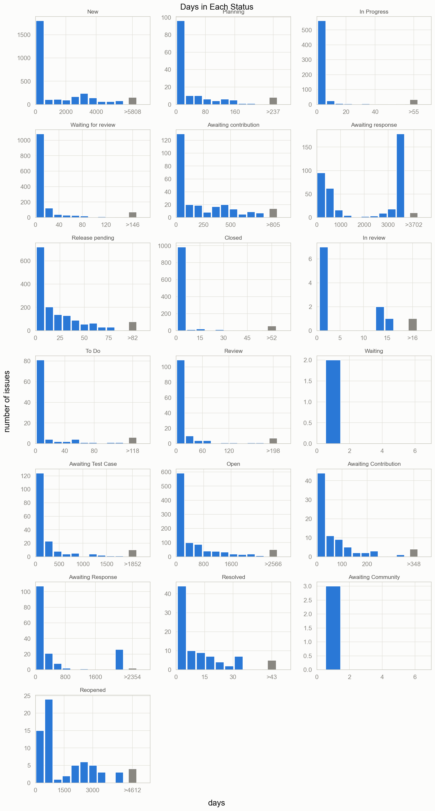

**Rework.** How many times tickets came back to review - each return is work done twice.

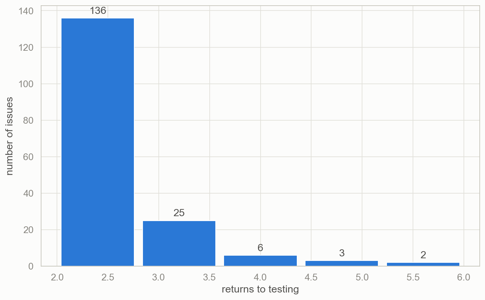

**Delivery (DORA).** Point it at the GitLab project behind the work, `--gitlab-project group/app --gitlab-token <token>`, and the report adds DORA's four keys: deploys per week, change lead time from commit to deploy, change fail rate and recovery time. Each release tag is a deploy (`--deploy-tag-pattern`, default `^v?\d+\.\d+\.\d+$`); a deploy failed when the next one is a hotfix (a merge request labelled `hotfix` or from a `hotfix*` branch), a revert, or a rollback to an earlier tag's commit. Name your coding agents with `--agent-authors srv_bot,agent@example.com` to compare their changes with people's.

## What it deliberately does not measure: individuals

The report names no one. Data on individuals works only as self-assessment that management never sees, and "if ever the data is used against even one individual, the entire data collection scheme will come to an abrupt halt" (DeMarco & Lister, *Peopleware*, 2nd ed., с. 61, PDF 74). They list "performance measurement in almost any form" among the things that kill teams (с. 183–184, PDF 196–197). A forecast also needs honest statuses in Jira: once people are measured by them, they stop being honest. So the report shows the system - flow, queues, handoffs - and ends with a reminder: these numbers describe the system; don't turn them into targets.

<details>
<summary>How the forecast is made and checked</summary>

### The forecast

- **What it predicts.** Of the issues open today, how many get done in the next H weeks, at 85% and at 50%. Each simulation draws past weeks' throughput and a share of finishes that went to issues already open, taken from past H-week windows. The headline promise is the 15th percentile of the done count.
- **Why a share.** Work is not served first-in, first-out: urgent and short jobs move to the front (Reinertsen, *The Principles of Product Development Flow*, с. 70, PDF 84), so new arrivals take part of every week. A queue's size is only the balance of arrivals and departures (с. 71–72, PDF 85–86), and with both random it may stay far from zero for long periods (Q15, the Diffusion Principle, с. 76–78, PDF 90–92). The baseline, all throughput to open issues, is the old belief, and the replay shows what it costs: on Hibernate it held 2 of 11 independent 8-week promises (14% of 83 past forecasts), against 9 of 11 with the share.
- **Fixed date, variable scope.** "How much by when" is the question a forecast can answer and check; "when will all of it be done" depends on work not yet asked for (Beck, *Extreme Programming Explained*, 1st ed., PDF 23). The clear date is still shown, from the same simulation, capped at 2 years.

### The replay

- **Only what was known then.** From every past Monday, each issue's status, resolution and assignee are rolled back through its changelog, so the replay sees reopened and not-yet-created work as it stood that day. A prediction system is valid only if it makes accurate predictions of what it claims to predict, established by comparing it with known data in its environment (Fenton & Pfleeger, *Software Metrics: A Rigorous Approach*, с. 104–105, PDF 117–118). So the replay checks the very forecast the headline shows, with the 85% promise as the acceptance range stated in advance.
- **Independent outcomes.** Forecasts made a week apart share most of their outcome. Each horizon also counts the promises whose intervals don't overlap; the verdict judges the longest horizon with at least 10 of them, and with fewer it states the count instead of a verdict. "Held 9 of 11" counts those independent promises; the table beside it also gives the share of all past forecasts.
- **Pace.** The same replay picks which past weeks the forecast draws from - the last 12, 26 or 52 weeks equally, or every week weighted by recency with a half-life of 4 or 8 weeks - by the lowest CRPS, a score of how far past forecasts landed from what happened. Paces within 5% of the best count as equal and the earlier in that list wins. Hibernate forecasts from the last 26 weeks, Kafka from a half-life of 4 weeks.
- **Bias and drift.** A u-plot per horizon shows whether past forecasts leaned optimistic, pessimistic or too narrow; a y-plot test (after Brocklehurst and Littlewood) shows whether their errors drift over time, tested on independent outcomes only. On Hibernate, 4-week forecast errors drift over time (y-plot p = 0.010): the team's pace changes.
- **Recalibration.** When errors keep a steady bias but don't drift, the book's remedy is tried: every past forecast is recalibrated by the u-plot of the forecasts whose outcomes were known by its Monday. It is used only when it also wins on a global score - CRPS standing in for the prequential likelihood Fenton and Pfleeger ask for - and the tile then says so.
- **The naive baseline.** A clever predictor may barely beat a naive one (Fenton & Pfleeger, Example 3.17, с. 105). So the table shows "baseline (all throughput to open issues)" next to the model, at every horizon.
- **Clear dates.** Past "all done by D" promises are judged only once D has passed, and only when their intervals don't overlap. On both trackers: 0 judged; all 90 past promises fall beyond the data so far.

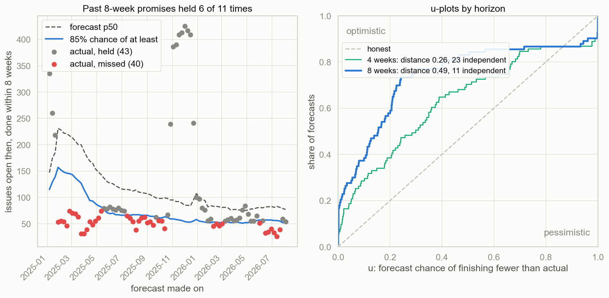

### Assumptions

- The past share of finishes going to issues already open carries over into the next H weeks.
- Dates beyond the checked horizon are extrapolated, and lean optimistic: the share falls as the horizon grows.
- Discarded issues are not "done": they leave the list but don't count toward the promise.
- Membership in a `--forecast-jql` scope is not rolled back: the replay takes today's scope as if it had been the scope on every past Monday.

</details>

## License

GPL v3 - see [LICENSE](LICENSE).
