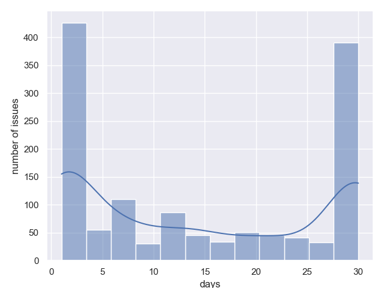

# Metrics: Jira Engineering Analytics Toolkit

[](https://github.com/your/repo/actions)
[](https://github.com/your/repo/actions)
[](LICENSE)

---

## 🚀 Vision
**Metrics** empowers engineering teams to understand, visualize, and improve their software delivery process using real Jira data. It’s designed for:
- Engineering managers and leads
- Data-driven teams
- Process improvement advocates
- Anyone who wants actionable insights from Jira

---

## ✨ Features
- **Fetches issues from Jira** using JQL (supports cloud and server)
- **Calculates key metrics:**
  - Cycle time
  - Lead time
  - Queue time (per status)
  - Throughput (weekly)
  - Cumulative queue time (p50 per status)
  - Return to testing (how often issues return to QA)
- **Visualizes metrics** as clear PNG charts (histograms, bar charts, etc.)
- **Flexible configuration:** CLI, environment variables, or YAML/JSON config file
- **Fast, robust, and fully tested**
- **Extensible:** Modular architecture for adding new metrics or data sources

---

## 🏗️ Architecture Overview
- **CLI entrypoint:** `metrics/__main__.py` (uses Click)
- **Dependency injection:** Clean, testable services via `dependency_injector`
- **Services:** Metrics calculation, visualization, and Jira repository
- **Entities:** Strongly-typed Issue model
- **Config:** Merges CLI, env, and config file (YAML/JSON)
- **Output:** All charts saved to `output/` directory

---

## ⚡ Quickstart

### 1. Install dependencies
```sh
poetry install
```

### 2. Run metrics analysis
```sh
python -m metrics --jira-server https://your-jira --jira-token <token> --jira-jql 'project=MYPROJ'
```

Or with a config file:
```sh
python -m metrics --config config.yaml
```

---

## ⚙️ Configuration Matrix

| Option      | CLI Option    | Env Var     | Config File Key | Required |
| ----------- | ------------- | ----------- | --------------- | -------- |
| Jira Server | --jira-server | JIRA_SERVER | jira.server     | Yes      |
| Jira Token  | --jira-token  | JIRA_TOKEN  | jira.token      | Yes      |
| Jira JQL    | --jira-jql    | JIRA_JQL    | jira.jql        | Yes      |
| Config File | --config      | N/A         | N/A             | No       |

- **Priority:** CLI > Env > Config file
- **Config file format:** YAML or JSON

### Example YAML
```yaml
jira:
  server: https://your-jira
  token: your-token
  jql: project=MYPROJ
```

### Example JSON
```json
{
  "jira": {
    "server": "https://your-jira",
    "token": "your-token",
    "jql": "project=MYPROJ"
  }
}
```

---

## 🖥️ Usage

Show help and examples:
```sh
python -m metrics --help
```

Typical run:
```sh
python -m metrics --jira-server https://your-jira --jira-token <token> --jira-jql 'project=MYPROJ'
```

**Output:**
- PNG charts for each metric in the `output/` directory

---

## 📊 Example Output

Below are sample charts generated by Metrics:

### Throughput


### Lead Time


### Cycle Time


### Queue Time (per status)
**Status: New**


**Status: Test**


---

## 🧪 Testing & Development

- **Run all tests:**
  ```sh
  make test
  ```
- **Check coverage:**
  ```sh
  make coverage
  ```
- **Lint and format:**
  ```sh
  make lint
  make format
  ```
- **Pre-commit hooks:**
  ```sh
  pre-commit install
  # Now every commit will be checked by Ruff
  ```

---

## 🛠️ Troubleshooting
- **Missing dependencies:** Install with `pip install -r requirements.txt` or `poetry install`.
- **YAML config error:** Install PyYAML: `pip install pyyaml`.
- **Jira connection error:** Check your server URL, token, and network access.
- **No output:** Check the `output/` directory and logs for errors.

---

## ❓ FAQ
**Q: Can I use this with Jira Cloud?**  
A: Yes! Just use your cloud URL and a valid API token.

**Q: Can I add new metrics or visualizations?**  
A: Yes! The code is modular—add new services or extend existing ones.

**Q: How do I contribute?**  
A: Fork, branch, run `make test` and `make lint`, and open a PR!

---

## 🤗 Contributing
We welcome contributions! Please:
- Follow the code style (enforced by Ruff)
- Add/maintain docstrings and tests
- Document new features in the README
- Open a clear, descriptive pull request

---

## 📄 License
MIT License. See [LICENSE](LICENSE).
