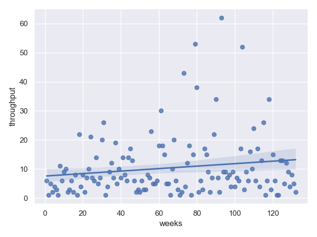

# Metrics: Jira Engineering Analytics Toolkit

[](https://github.com/your/repo/actions)
[](https://github.com/your/repo/actions)
[](LICENSE)

---

## 🚀 Vision
**Metrics** empowers engineering teams to understand, visualize, and improve their software delivery process using real Jira data. It’s designed for:
- Engineering managers and leads
- Data-driven teams
- Process improvement advocates
- Anyone who wants actionable insights from Jira

---

## ✨ Features
- **Fetches issues from Jira** using JQL (supports cloud and server)
- **Calculates key metrics:**
  - Cycle time
  - Lead time
  - Queue time (per status)
  - Throughput (weekly)
  - Cumulative queue time (p50 per status)
  - Return to testing (how often issues return to QA)
- **Visualizes metrics** as clear PNG charts (histograms, bar charts, etc.)
- **Flexible configuration:** CLI, environment variables, or YAML/JSON config file
- **Fast, robust, and fully tested**
- **Extensible:** Modular architecture for adding new metrics or data sources

---

## 🏗️ Architecture Overview
- **CLI entrypoint:** `metrics/__main__.py` (uses Click)
- **Dependency injection:** Clean, testable services via `dependency_injector`
- **Services:** Metrics calculation, visualization, and Jira repository
- **Entities:** Strongly-typed Issue model
- **Config:** Merges CLI, env, and config file (YAML/JSON)
- **Output:** All charts saved to `output/` directory

---

## ⚡ Quickstart

### 1. Prerequisites
- Python 3.11+
- `make`

### 2. Installation
Create a virtual environment and install dependencies:
```sh
make install
```
This will create a `.venv` directory with all the necessary packages.

### 3. Configuration
The tool can be configured via a configuration file, environment variables, or CLI options.

**Configuration File:**
Create a `config.yaml` or `config.json` file in the root directory.

*Example `config.yaml`:*
```yaml
jira:
  server: https://your-jira-instance.com
  token: "YOUR_JIRA_API_TOKEN"
  jql: "project = 'YOUR_PROJECT_KEY'"
```

**Environment Variables:**
You can also set environment variables:
```sh
export JIRA_SERVER="https://your-jira-instance.com"
export JIRA_TOKEN="YOUR_JIRA_API_TOKEN"
export JIRA_JQL="project = 'YOUR_PROJECT_KEY'"
```

### 4. Run Analysis
To run the metrics analysis, use the `run` target in the Makefile. It will automatically use the activated virtual environment.
```sh
make run
```
You can also pass CLI arguments, which will override the configuration file and environment variables.
```sh
make run ARGS="--jira-server https://your-jira --jira-token <token> --jira-jql 'project=MYPROJ'"
```

All charts will be saved to the `output/` directory.

---

## 🖥️ Usage
For a full list of commands and options, run:
```sh
make run ARGS="--help"
```

---

## 📊 Example Output

Below are sample charts generated by Metrics:

### Throughput


### Lead Time


### Cycle Time


### Queue Time (per status)
**Status: New**


**Status: Test**


---

## 🧪 Testing & Development
This project uses `make` to streamline development tasks.

- **Linting:** Check for code style and errors.
  ```sh
  make lint
  ```
- **Formatting:** Automatically format the code.
  ```sh
  make format
  ```
- **Testing:** Run the test suite.
  ```sh
  make test
  ```
- **Test Coverage:** Run tests and see the coverage report.
  ```sh
  make coverage
  ```

---

## 🛠️ Troubleshooting
- **`make` command not found:** Make sure you have `make` installed. It is standard on most Linux and macOS systems. For Windows, you might need to install it as part of a development toolchain like `msys2` or use WSL.
- **Dependency Issues:** If you encounter issues with dependencies, you can try cleaning the virtual environment and reinstalling:
  ```sh
  make clean && make install
  ```
- **Jira Connection Error:** Double-check your Jira server URL, API token, and JQL query. Ensure you have network access to your Jira instance.

---

## ❓ FAQ
**Q: Can I use this with Jira Cloud?**  
A: Yes! Just use your cloud URL and a valid API token.

**Q: Can I add new metrics or visualizations?**  
A: Yes! The code is modular—add new services or extend existing ones.

**Q: How do I contribute?**  
A: Fork, branch, run `make test` and `make lint`, and open a PR!

---

## 🤗 Contributing
We welcome contributions! Please:
- Follow the code style (enforced by Ruff)
- Add/maintain docstrings and tests
- Document new features in the README
- Open a clear, descriptive pull request

---

## 📄 License
MIT License. See [LICENSE](LICENSE).
